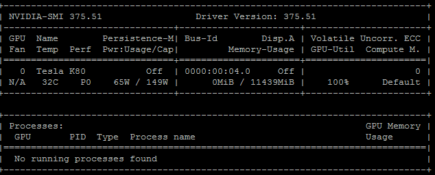

# Keras-on-google-compute-engine

This is just an installation guide how to install Keras on Google Compute Engine `Centos 7`.

yum install python-devel sqlite-devel -y

## Install CUDA 8.0 driver and toolkit on GCP Centos 

See Google Reference  [https://cloud.google.com/compute/docs/gpus/add-gpus](https://cloud.google.com/compute/docs/gpus/add-gpus)

Run this script once as `root`
```
#!/bin/bash
echo "Checking for CUDA and installing."
# Check for CUDA and try to install.
if ! rpm -q  cuda; then
  curl -O http://developer.download.nvidia.com/compute/cuda/repos/rhel7/x86_64/cuda-repo-rhel7-8.0.61-1.x86_64.rpm
  rpm -i --force ./cuda-repo-rhel7-8.0.61-1.x86_64.rpm
  yum clean all
  yum install epel-release -y
  yum update -y
  yum install cuda -y
fi
# Verify that CUDA installed; retry if not.
if ! rpm -q  cuda; then
  yum install cuda -y
fi
```

### Set environments variables

You can create a new file ``/etc/profile.d/cuda.sh`` to make enviorment variables setting globally or just add them into your home directory `~/.bashrc`. 

```
export CUDA_HOME=/usr/local/cuda
export PATH=$PATH:$CUDA_HOME/bin
export LD_LIBRARY_PATH=$LD_LIBRARY_PATH:$CUDA_HOME/lib64
```

# Install cuDNN
[Register and download cuDNN](https://developer.nvidia.com/cudnn)

```
~$ tar xzvf cudnn-8.0-linux-x64-v6.0.tgz
~$ sudo cp cuda/lib64/* /usr/local/cuda/lib64/
~$ sudo cp cuda/include/cudnn.h /usr/local/cuda/include/
~$ sudo ln -s /usr/local/cuda/lib64/libcudnn.so.6 /usr/local/cuda/lib64/libcudnn.so.5
```

The last trick is because Keras package is using `libcudnn.so.5` as default dependency. Our download is version 6. We create a symbolic link to avoid errors and it actually works.


### Confirm Cuda installed successfully

Run:
```
nvidia-smi

```

You will see pic like below



# Install python packages

### Install python directly 

Create the ``requirements.txt`` file:

```
scikit-learn
futures
scipy
pandas
pysqlite
tensorflow
tensorflow-gpu
Keras
```

Run ``pip install -r requirements.txt`` to install all python packages. 


### Install Anaconda3 (Alternative and Easier)

Anaconda is the most popular and trusted data science ecosystem. The following steps shows how to install.

```
sudo yum install bzip2 -y
curl -O https://repo.continuum.io/archive/Anaconda3-4.3.1-Linux-x86_64.sh
bash Anaconda3-4.3.1-Linux-x86_64.sh
```

Follow the instrunction to install and add `Anacoda HOME` into your `path`.

``
$ python -V
Python 3.6.0 :: Anaconda 4.3.1 (64-bit)
``

#### Create your own python running environment use `conda`

```
   # conda create --name <env_name> [list of packages] , for example.
      conda create --name my_python3 

   # Activate the environment 
      source activate  my_python3
      
   # Deactive the environment
      source deactive  my_python3

   # List all environments
      conda info --envs

   # Clone an environemnt 
      conda create --name my_python3_2 --clone my_python3

   # Remove an environemnt 
      conda remove --name my_python3_2 --all

   # Export an environment into a yaml file 
      source activate  my_python3
      conda env export > environment.yml

   # Create an environment from a yaml file 
      conda env create -f environment.yml
```

#### Install required python packages

Create the ``requirements.anacoda.txt`` file:
```
$ cat requirements.anacoda.txt
futures
tensorflow
tensorflow-gpu
Keras
```

Run: 
```
$ conda create --name datascience
$ source activate datascience
(datascience) $ pip install -r requirements.anacoda.txt
```

Simple try those imports, should be imported correctly with no errors.

```
from keras.callbacks import ModelCheckpoint
from keras.layers import Masking, LSTM, Dense
from keras.layers.core import Dropout
from keras.layers.wrappers import TimeDistributed
import keras.backend.tensorflow_backend as K
import pandas as pd
import numpy as np
```

## Example
   Use ``mnist`` as our starter example [https://github.com/tensorflow/tensorflow/tree/r1.3/tensorflow/examples/tutorials/mnist] 

mnist_softmax.py

```
(datascience) $  python mnist_softmax.py --data_dir data

Successfully downloaded train-images-idx3-ubyte.gz 9912422 bytes.
Extracting data/train-images-idx3-ubyte.gz
Successfully downloaded train-labels-idx1-ubyte.gz 28881 bytes.
Extracting data/train-labels-idx1-ubyte.gz
Successfully downloaded t10k-images-idx3-ubyte.gz 1648877 bytes.
Extracting data/t10k-images-idx3-ubyte.gz
Successfully downloaded t10k-labels-idx1-ubyte.gz 4542 bytes.
Extracting data/t10k-labels-idx1-ubyte.gz
2017-08-23 20:40:27.074516: W tensorflow/core/platform/cpu_feature_guard.cc:45] The TensorFlow library wasn't compiled to use SSE4.1 instructions, but these are available on your machine and could speed up CPU computations.
2017-08-23 20:40:27.074577: W tensorflow/core/platform/cpu_feature_guard.cc:45] The TensorFlow library wasn't compiled to use SSE4.2 instructions, but these are available on your machine and could speed up CPU computations.
2017-08-23 20:40:27.074587: W tensorflow/core/platform/cpu_feature_guard.cc:45] The TensorFlow library wasn't compiled to use AVX instructions, but these are available on your machine and could speed up CPU computations.
2017-08-23 20:40:27.074594: W tensorflow/core/platform/cpu_feature_guard.cc:45] The TensorFlow library wasn't compiled to use AVX2 instructions, but these are available on your machine and could speed up CPU computations.
2017-08-23 20:40:27.074601: W tensorflow/core/platform/cpu_feature_guard.cc:45] The TensorFlow library wasn't compiled to use FMA instructions, but these are available on your machine and could speed up CPU computations.
2017-08-23 20:40:29.468172: I tensorflow/stream_executor/cuda/cuda_gpu_executor.cc:893] successful NUMA node read from SysFS had negative value (-1), but there must be at least one NUMA node, so returning NUMA node zero
2017-08-23 20:40:29.469181: I tensorflow/core/common_runtime/gpu/gpu_device.cc:955] Found device 0 with properties:
name: Tesla K80
major: 3 minor: 7 memoryClockRate (GHz) 0.8235
pciBusID 0000:00:04.0
Total memory: 11.17GiB
Free memory: 11.11GiB
2017-08-23 20:40:29.469238: I tensorflow/core/common_runtime/gpu/gpu_device.cc:976] DMA: 0
2017-08-23 20:40:29.469246: I tensorflow/core/common_runtime/gpu/gpu_device.cc:986] 0:   Y
2017-08-23 20:40:29.469258: I tensorflow/core/common_runtime/gpu/gpu_device.cc:1045] Creating TensorFlow device (/gpu:0) -> (device: 0, name: Tesla K80, pci bus id: 0000:00:04.0)
0.9182

```

mnist_deep.py

```
(datascience) $ python mnist_deep.py --data_dir data
Extracting data/train-images-idx3-ubyte.gz
Extracting data/train-labels-idx1-ubyte.gz
Extracting data/t10k-images-idx3-ubyte.gz
Extracting data/t10k-labels-idx1-ubyte.gz
Saving graph to: /tmp/tmp3x1g8twx
2017-08-23 21:09:14.432169: W tensorflow/core/platform/cpu_feature_guard.cc:45] The TensorFlow library wasn't compiled to use SSE4.1 instructions, but these are available on your machine and could speed up CPU computations.
2017-08-23 21:09:14.432228: W tensorflow/core/platform/cpu_feature_guard.cc:45] The TensorFlow library wasn't compiled to use SSE4.2 instructions, but these are available on your machine and could speed up CPU computations.
2017-08-23 21:09:14.432236: W tensorflow/core/platform/cpu_feature_guard.cc:45] The TensorFlow library wasn't compiled to use AVX instructions, but these are available on your machine and could speed up CPU computations.
2017-08-23 21:09:14.432242: W tensorflow/core/platform/cpu_feature_guard.cc:45] The TensorFlow library wasn't compiled to use AVX2 instructions, but these are available on your machine and could speed up CPU computations.
2017-08-23 21:09:14.432247: W tensorflow/core/platform/cpu_feature_guard.cc:45] The TensorFlow library wasn't compiled to use FMA instructions, but these are available on your machine and could speed up CPU computations.
2017-08-23 21:09:16.876049: I tensorflow/stream_executor/cuda/cuda_gpu_executor.cc:893] successful NUMA node read from SysFS had negative value (-1), but there must be at least one NUMA node, so returning NUMA node zero
2017-08-23 21:09:16.876992: I tensorflow/core/common_runtime/gpu/gpu_device.cc:955] Found device 0 with properties:
name: Tesla K80
major: 3 minor: 7 memoryClockRate (GHz) 0.8235
pciBusID 0000:00:04.0
Total memory: 11.17GiB
Free memory: 11.11GiB
2017-08-23 21:09:16.877020: I tensorflow/core/common_runtime/gpu/gpu_device.cc:976] DMA: 0
2017-08-23 21:09:16.877037: I tensorflow/core/common_runtime/gpu/gpu_device.cc:986] 0:   Y
2017-08-23 21:09:16.877049: I tensorflow/core/common_runtime/gpu/gpu_device.cc:1045] Creating TensorFlow device (/gpu:0) -> (device: 0, name: Tesla K80, pci bus id: 0000:00:04.0)
step 0, training accuracy 0.06
step 100, training accuracy 0.88
step 200, training accuracy 0.8
step 300, training accuracy 0.98
step 400, training accuracy 0.96
step 500, training accuracy 0.9
step 600, training accuracy 0.96
step 700, training accuracy 0.96
step 800, training accuracy 0.94
step 900, training accuracy 1
step 1000, training accuracy 0.92
step 1100, training accuracy 0.98
step 1200, training accuracy 1
step 1300, training accuracy 0.98
step 1400, training accuracy 0.96
step 1500, training accuracy 1
step 1600, training accuracy 0.98
step 1700, training accuracy 0.98
step 1800, training accuracy 1
step 1900, training accuracy 1
step 2000, training accuracy 0.96
step 2100, training accuracy 1
step 2200, training accuracy 0.98
step 2300, training accuracy 0.98
step 2400, training accuracy 0.98
step 2500, training accuracy 0.98
step 2600, training accuracy 1
step 2700, training accuracy 0.96
step 2800, training accuracy 1
step 2900, training accuracy 1
step 3000, training accuracy 0.96
step 3100, training accuracy 1
step 3200, training accuracy 1
step 3300, training accuracy 1
step 3400, training accuracy 1
step 3500, training accuracy 1
step 3600, training accuracy 0.98
step 3700, training accuracy 1
step 3800, training accuracy 1
step 3900, training accuracy 0.98
step 4000, training accuracy 1
step 4100, training accuracy 0.98
step 4200, training accuracy 0.98
step 4300, training accuracy 1
step 4400, training accuracy 0.98
step 4500, training accuracy 1
step 4600, training accuracy 1
step 4700, training accuracy 0.98
step 4800, training accuracy 0.96
step 4900, training accuracy 1
step 5000, training accuracy 1
step 5100, training accuracy 1
step 5200, training accuracy 1
step 5300, training accuracy 1
step 5400, training accuracy 1
step 5500, training accuracy 1
step 5600, training accuracy 1
step 5700, training accuracy 0.96
step 5800, training accuracy 1
step 5900, training accuracy 1
step 6000, training accuracy 0.98
step 6100, training accuracy 1
step 6200, training accuracy 0.96
step 6300, training accuracy 1
step 6400, training accuracy 1
step 6500, training accuracy 1
step 6600, training accuracy 1
step 6700, training accuracy 1
step 6800, training accuracy 0.98
step 6900, training accuracy 1
step 7000, training accuracy 1
step 7100, training accuracy 1
step 7200, training accuracy 0.98
step 7300, training accuracy 0.96
step 7400, training accuracy 1
step 7500, training accuracy 0.98
step 7600, training accuracy 1
step 7700, training accuracy 1
step 7800, training accuracy 1
step 7900, training accuracy 1
step 8000, training accuracy 1
step 8100, training accuracy 1
step 8200, training accuracy 1
step 8300, training accuracy 0.96
step 8400, training accuracy 1
step 8500, training accuracy 1
step 8600, training accuracy 0.98
step 8700, training accuracy 1
step 8800, training accuracy 0.98
step 8900, training accuracy 1
step 9000, training accuracy 1
step 9100, training accuracy 1
step 9200, training accuracy 0.98
step 9300, training accuracy 1
step 9400, training accuracy 1
step 9500, training accuracy 1
step 9600, training accuracy 1
step 9700, training accuracy 1
step 9800, training accuracy 1
step 9900, training accuracy 0.98
step 10000, training accuracy 1
step 10100, training accuracy 1
step 10200, training accuracy 1
step 10300, training accuracy 1
step 10400, training accuracy 1
step 10500, training accuracy 1
step 10600, training accuracy 0.96
step 10700, training accuracy 1
step 10800, training accuracy 1
step 10900, training accuracy 0.98
step 11000, training accuracy 1
step 11100, training accuracy 1
step 11200, training accuracy 1
step 11300, training accuracy 1
step 11400, training accuracy 1
step 11500, training accuracy 1
step 11600, training accuracy 1
step 11700, training accuracy 1
step 11800, training accuracy 1
step 11900, training accuracy 1
step 12000, training accuracy 1
step 12100, training accuracy 1
step 12200, training accuracy 1
step 12300, training accuracy 1
step 12400, training accuracy 1
step 12500, training accuracy 1
step 12600, training accuracy 1
step 12700, training accuracy 1
step 12800, training accuracy 1
step 12900, training accuracy 1
step 13000, training accuracy 1
step 13100, training accuracy 1
step 13200, training accuracy 1
step 13300, training accuracy 1
step 13400, training accuracy 1
step 13500, training accuracy 1
step 13600, training accuracy 1
step 13700, training accuracy 0.98
step 13800, training accuracy 1
step 13900, training accuracy 1
step 14000, training accuracy 1
step 14100, training accuracy 1
step 14200, training accuracy 1
step 14300, training accuracy 1
step 14400, training accuracy 1
step 14500, training accuracy 1
step 14600, training accuracy 1
step 14700, training accuracy 1
step 14800, training accuracy 1
step 14900, training accuracy 1
step 15000, training accuracy 1
step 15100, training accuracy 1
step 15200, training accuracy 0.98
step 15300, training accuracy 1
step 15400, training accuracy 0.98
step 15500, training accuracy 1
step 15600, training accuracy 1
step 15700, training accuracy 0.98
step 15800, training accuracy 1
step 15900, training accuracy 1
step 16000, training accuracy 1
step 16100, training accuracy 0.98
step 16200, training accuracy 1
step 16300, training accuracy 1
step 16400, training accuracy 1
step 16500, training accuracy 1
step 16600, training accuracy 1
step 16700, training accuracy 1
step 16800, training accuracy 1
step 16900, training accuracy 1
step 17000, training accuracy 1
step 17100, training accuracy 1
step 17200, training accuracy 1
step 17300, training accuracy 1
step 17400, training accuracy 1
step 17500, training accuracy 1
step 17600, training accuracy 1
step 17700, training accuracy 1
step 17800, training accuracy 1
step 17900, training accuracy 1
step 18000, training accuracy 1
step 18100, training accuracy 1
step 18200, training accuracy 1
step 18300, training accuracy 1
step 18400, training accuracy 1
step 18500, training accuracy 1
step 18600, training accuracy 1
step 18700, training accuracy 1
step 18800, training accuracy 1
step 18900, training accuracy 1
step 19000, training accuracy 1
step 19100, training accuracy 1
step 19200, training accuracy 1
step 19300, training accuracy 1
step 19400, training accuracy 1
step 19500, training accuracy 1
step 19600, training accuracy 1
step 19700, training accuracy 0.98
step 19800, training accuracy 1
step 19900, training accuracy 1
test accuracy 0.9918
```

